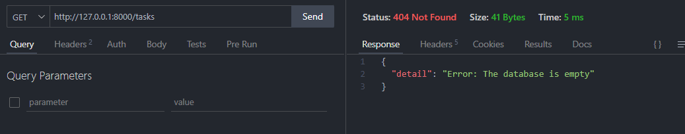
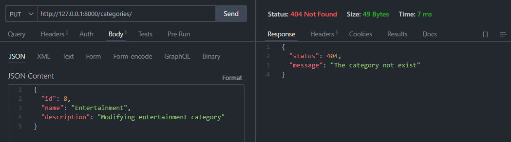
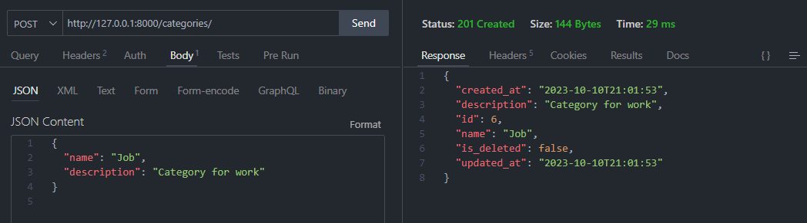
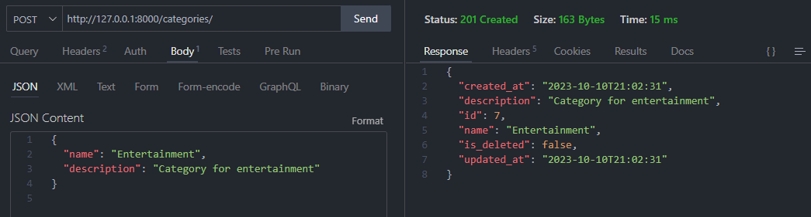
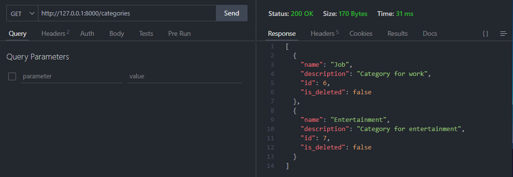
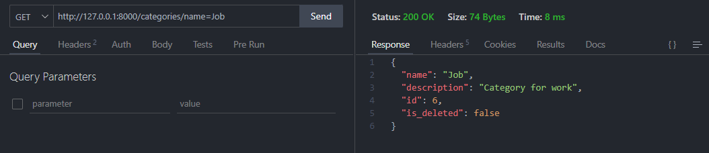
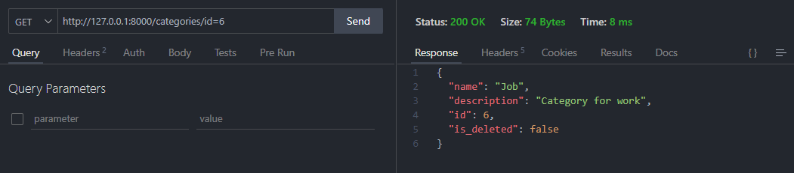
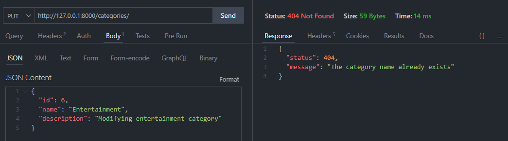
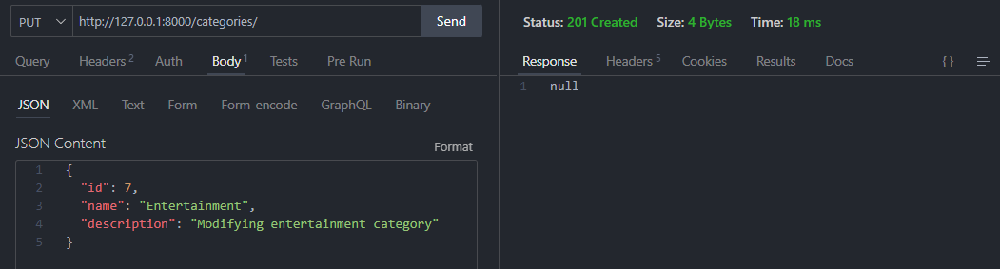

# Categorías

* La base de datos está vacía:

* Cuando una categoría no existe:

* Insertando una categoría:

* Consultando las categorías insertadas:

* Consultar una categoría por su nombre:

* Consultar una categoría por su ID:

* No repetir categorías:

* Actualizar una categoría:

Estas son las funciones principales del módulo de creación de categorías que se encuentra en la ruta del proyecto: [Ruta del módulo: Categorias](https://github.com/ErickSiguache/Task-List-API/tree/main/src/modules/categories)
