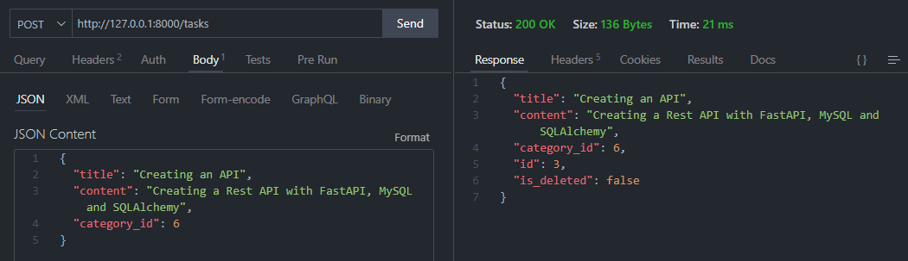
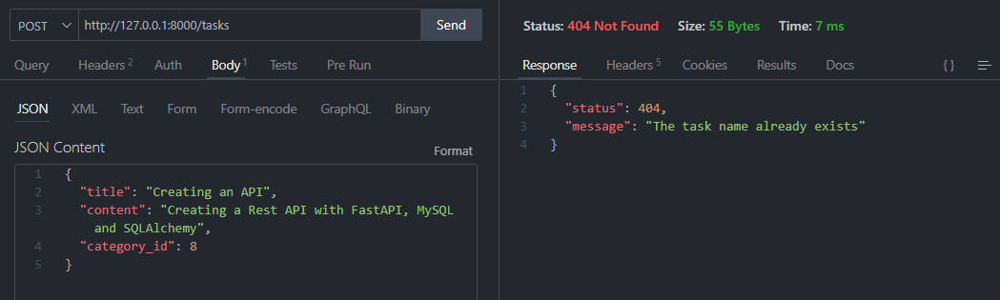
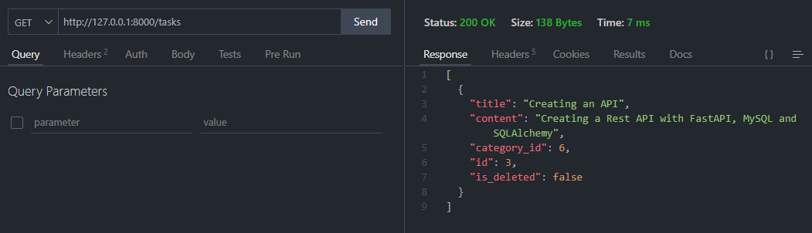
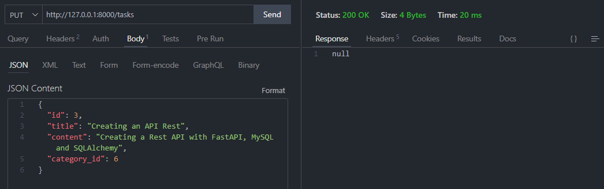

# Tareas

* Insertando una tarea:

* Insertando una tarea con una categoría que no existe:

* Consultando la tarea insertada:

* Actualizando una tarea:

Estas son las funciones principales del módulo de creación de tareas que se encuentran en la ruta del proyecto: [Ruta del módulo: Tareas](https://github.com/ErickSiguache/Task-List-API/tree/main/src/modules/tasks)
